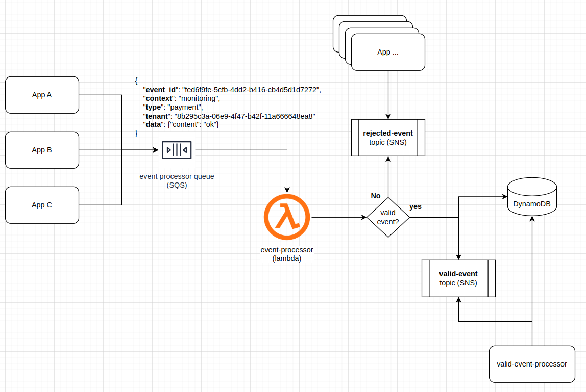

<p align="center">


&nbsp&nbsp&nbsp&nbsp&nbsp&nbsp&nbsp&nbsp&nbsp&nbsp&nbsp&nbsp&nbsp&nbsp


</p>

# go-event-processor
- O go-event-processor é um serviço de processamento de eventos, sendo responsável por realizar a validação, triagem e persistência do evento para consumo em um serviço posteriormente.

- Dos requisitos do desafio foi implementado: AWS || Localstack || container || SQS || SNS || Lambda || golang || dynamoDB || arquitetura de microsserviços.

## 🛠️ Serviço construído com

- [Golang](https://go.dev/) - [Lambda](https://aws.amazon.com/lambda/) - [SQS](https://aws.amazon.com/sqs/) - [SNS](https://aws.amazon.com/sns/) - [DynamoDB](https://aws.amazon.com/dynamodb/)

# 🚀 Começando

Essas instruções permitirão que você obtenha uma cópia do projeto em operação na sua máquina local para fins de desenvolvimento e teste. Para um entendimento geral, segue um desenho da arquitetura atual.

O serviço foi pensado para que houvesse a menor quantidade de perdas possíveis. Dessa forma, foi utilizado estratégias de retry em conjunto com eventos de rejeição da mensagem quando fora do padrão, para que os produres possam receber e reagir de alguma forma.

# 📋 Pré-requisitos

- [docker](https://docs.docker.com/) - [docker-compose](https://docs.docker.com/compose/) - [golang](https://go.dev/)

# 🔧 Instalando

Clonar o repositório

```
git clone https://github.com/vitorbgouveia/go-event-processor.git
```

Acessar diretório raiz e executar:
```
make setup
```
Esse comando irá provisionar todos os recursos necessários para testar a aplicação via container. Nos logs de depuração, você verá um log simular a `##### All resources initialized! 🚀 #####`. Representado que todos os recursos foram provisionados e estão prontos para receber solicitações.


Caso deseje mais opções de comando e mais informações, execute:

```
make
```
Recebendo então um resultado similar ao apresentado logo abaixo.
```
clean-all: Remove all containers and delete volumes.
help: Show help for each of the Makefile recipes.
list-queues: Return list of create queues
localstack-run-it: Execute in iterable mode localstack.
mocks-generate: generate all mocks to use in tests
send-events: Send events to event-processor; Default: --qtd-events-send 2 --event-send-semaphore 10
setup: Up localstack and configure all resources with policies.
test-coverage: Run all tests and open coverage per file in browser
test: Run all test
```


Show!!! Você agora já tem tudo configurado e está pronto para processar seus eventos com o mínimo de perda de dados possível.

Para disparar alguns eventos de teste, execute `make send-events`. Este comando irá executar um script producer, encontrado no diretório cmd/producer/main.go. Por padrão, ele irá disparar 2 eventos válidos e 2 inválidos. No entanto fique a vontade para alterar conforme sua necessidade de teste:

# 🔩 Tests

Os testes são muito importantes no desenvolvimento de software. Eles geralmente focam em determinar se os serviços desenvolvidos vão de encontro com as expectativas relacionadas à funcionalidade, confiabilidade, performance e segurança da aplicação.

Os arquivos com sufixo .test.go por padrão são entendindos como arquivos de testes unitários.

Para executar testes unitários:

```
make test
```

Para executar testes unitários com relatório de cobertura de código:

```
make test-coverage
```
```
go test ./... -coverprofile=coverage.out
?       github.com/vitorbgouveia/go-event-processor/cmd/lambda  [no test files]
?       github.com/vitorbgouveia/go-event-processor/cmd/producer        [no test files]
ok      github.com/vitorbgouveia/go-event-processor/internal/models     0.018s  coverage: 100.0% of statements
?       github.com/vitorbgouveia/go-event-processor/internal/repository/mocks   [no test files]
ok      github.com/vitorbgouveia/go-event-processor/internal/repository 0.129s  coverage: 100.0% of statements
ok      github.com/vitorbgouveia/go-event-processor/pkg 0.024s  coverage: 100.0% of statements
?       github.com/vitorbgouveia/go-event-processor/pkg/aws/mocks       [no test files]
?       github.com/vitorbgouveia/go-event-processor/pkg/logger  [no test files]
ok      github.com/vitorbgouveia/go-event-processor/pkg/aws     0.052s  coverage: 100.0% of statements
ok      github.com/vitorbgouveia/go-event-processor/pkg/worker  0.029s  coverage: 100.0% of statements
```

# 🖇️ Colaboradores

- **Vitor Gouveia** - _Planejamento e Desenvolvimento_ - [Github](https://github.com/vitorbgouveia)

Você também pode ver a lista de todos os [colaboradores](https://github.com/vitorbgouveia/go-event-processor/graphs/contributors) que participaram deste projeto.
